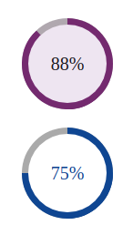

<h1 align="center">my-test-react-component V1.53.0</h1>
<p>
  <a href="https://www.npmjs.com/package/my-test-react-component" target="_blank">
    
  </a>
  <a href="#" target="_blank">
    
  </a>
</p>

> This npm is used to generate progressbar based on percentage



## Installation

```sh
npm i my-test-react-component
```

## Using with React

```sh
import React from "react";
import ProgressBar from "my-test-react-component";

export default class progressbar extends React.Component {
  render() {
    return (
      <div>
        <ProgressBar
          percentage="88"
          progressSelectedColor="#732272"
          progessDeSelectedColor="#B1A9B1"
          progressTextSize="20px"
          progressTextColor="#110E13"
          progressBgColor="#EEE6F2"
        />
        <ProgressBar
          percentage="75"
          progressSelectedColor="#1A4097"
          progessDeSelectedColor="#acacac"
          progressTextSize="20px"
          progressTextColor="#1A4097"
          progressBgColor="#FFF"
        />
      </div>
    );
  }
}
```

## Run

```sh
npm start
```

## Author

👤 **Ankit**

## Show your support

Give a ⭐️ if this project helped you!

---
